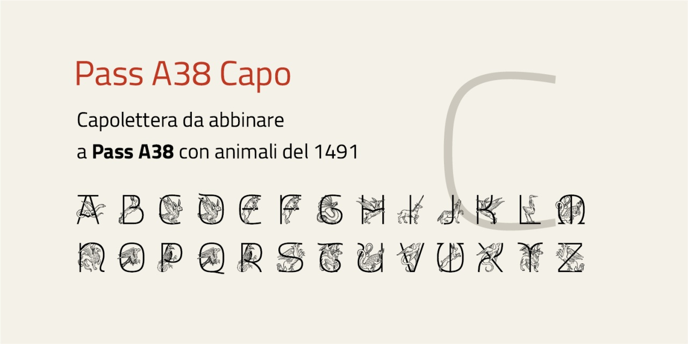
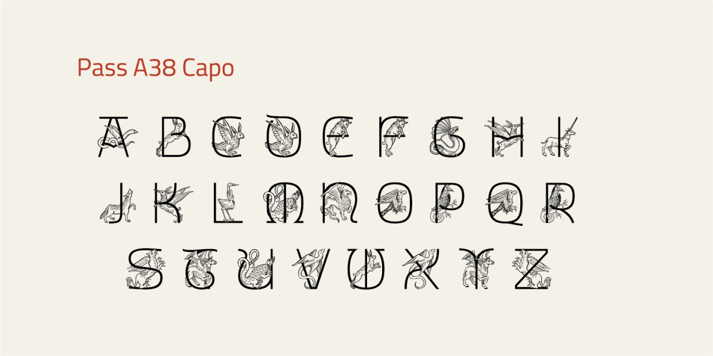
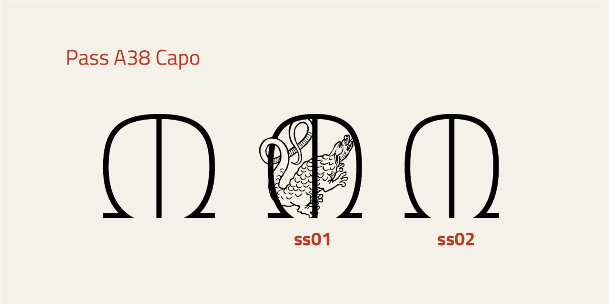

# Pass A38 Capo
* Versione 1.206: modifica alla lettera D
* Versione 1.204: fix minori e aggiunta di caratteri accentati (À Á È É Ì Í Ò Ó Ù Ú Ý)
* Versione 1.201: risistemazione con font variabile e spostamente dei capolettera con animali in ss01
* Versione 1.107: modifica /D /K /M /W
* Versione 1.105: fix minori
* Versione 1.104: sistemazione di alcuni caratteri
* Versione 1.101: sistemazione di alcuni caratteri
* Versione 1.0: versione iniziale

## Utilizzo
Il font può essere utilizzato tramite un unico file in formato WOFF2 con il seguente codice CSS. Ovviamente il percorso del file deve essere adattato alla specifica situazione.

    @font-face {
        font-family: "Pass A38 Capo";
        src: url("Pass_A38_capo.woff2") format("woff2");
    }

## Descrizione

Il font "Pass A38 Capo" è un esperimento per un capolettera da abbinare a [Pass A38](https://github.com/m-casanova/Pass-A38).

È derivato da _Titillium Title_ dell'Accademia di Belle Arti di Urbino, cercando di dare un aspetto tardo medievale ai capolettera.

Tramite caratteristica __ss01__ sono disponibili i capolettera monospaziati con animali tratti da _[Hortus Sanitatis](https://www.digitale-sammlungen.de/de/view/bsb00027846)_, 1491 (München, Bayerische Staatsbibliothek, pubblico dominio).
Il carattere relativo all'asterisco __*__ corrisponde a un gatto.

Tramite caratteristica __ss02__ sono presenti varianti per le lettere M e W.

