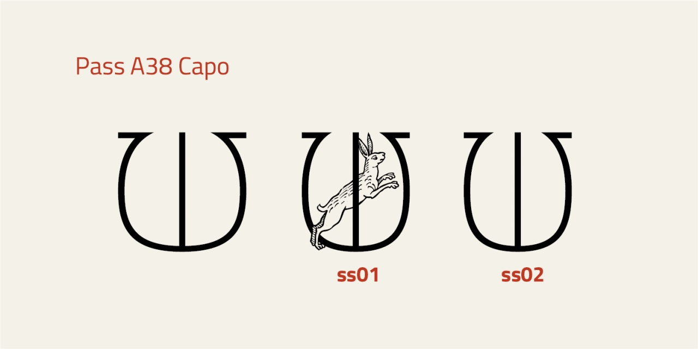

# Pass A38 Capo

* Versione 1.0: versione iniziale

## Utilizzo
Il font può essere utilizzato tramite un unico file in formato WOFF2 con il seguente codice CSS. Ovviamente il percorso del file deve essere adattato alla specifica situazione.

    @font-face {
        font-family: "Pass A38";
        src: url("Pass_A38_capo.woff2") format("woff2");
    }

## Descrizione

Il font "Pass A38 Capo" è un esperimento per un capolettera da abbinare a [Pass A38](https://github.com/m-casanova/Pass-A38).

È derivato da _Titillium Title_ dell'Accademia di Belle Arti di Urbino (conservato come caratteristica __ss01__).

Si è cercato di dare un aspetto tardo medievale ai capolettera, anche aggiungendo animali tratti da [Hortus Sanitatis](https://www.digitale-sammlungen.de/de/view/bsb00027846), 1491 (München, Bayerische Staatsbibliothek, pubblico dominio).
Il carattere relativo all'asterisco __*__ corrisponde a un gatto.

